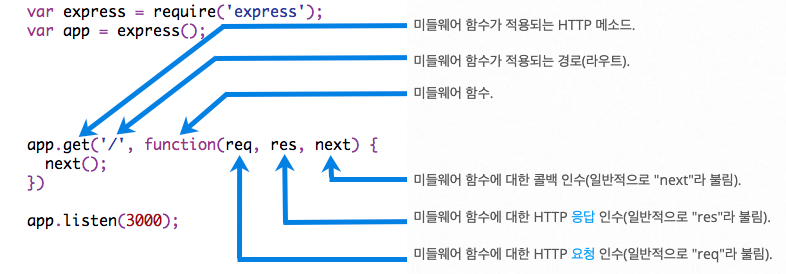

# API 만들고 사용해보기

## API 만들고 사용해보기

프로젝트에 돌입했을 때, 백엔드 완성 후 프론트엔드 개발이 시작되면 좋겠지만 실제로는 백엔드, 프론트엔드 개발이 평행하게 진행될 때가 많다. 백엔드 개발에 의존성이 큰 화면을 구현하게 된다면 언제까지고 기다렸다 개발할 수 없는 노릇이다.

로컬에서 Mock Data를 만들어놓고 쓰는 경우는 로딩 처리나 에러 핸들링 등의 사이드 이펙트를 고려하지 못해 난감한 경우가 생길 수 있다.

이 때, 라이브러리나 프레임워크를 사용하여 만든 Mock API로 데이터를 받아 미리 구현해놓고 백엔드 개발이 완료되면 API를 갈아끼우는 형식으로 작업할 수 있다.


## Express

Express javascript에서 사용하는 웹 프레임워크의 종류 중 하나로, 대부분 Node.js에서 웹 서버를 구축하기 위해 사용된다.

### 특징

#### **간단한 구현 방식**

```js
const express = require('express')
const app = express()
const port = 3000

app.get('/', (req, res) => {
  res.send('Hello World!')
})

app.listen(port, () => {
  console.log(`Example app listening on port ${port}`)
})
```

위 코드는 `'Hello World!'`를 출력하는 예제로, 보이는 것과 같이 다른 프레임워크보다 직관적이고 간단하게 구현할 수 있다.

#### **라우팅**

URI와 HTTP Method가 담긴 클라이언트 요청에 응답하는 방법을 의미한다. 기본 라우트의 구조는 다음과 같다.

```js
app.METHOD(PATH, HANDLER)
```

* app : express instance
* [METHOD](../week3/step-0./rest-api.md#rest) : HTTP Method
* PATH : 서버에서의 경로
* HANDLER : 라우트가 일치할 때 실행되는 함수
  * 첫번째 인자 : request
  * 두번째 인자 : response
  * 세번째 인자 : next(미들웨어 섹션에서 설명)

예시)

```js
app.get('/', function (req, res) {
  res.send('Hello World!');
});
```

```js
app.delete('/user', function (req, res) {
  res.send('Got a DELETE request at /user');
});
```

콜백함수 내에서 `res`(응답)와 사용할 수 있는 메서드는 다음과 같다.

* res.download() : 파일이 다운로드되도록 프롬프트합니다.
* res.end() : 응답 프로세스를 종료합니다.
* **res.json() : JSON 응답을 전송합니다.**
* res.jsonp() : JSONP 지원을 통해 JSON 응답을 전송합니다.
* res.redirect() : 요청의 경로를 재지정합니다.
* res.render() : 보기 템플리트를 렌더링합니다.
* res.send() : 다양한 유형의 응답을 전송합니다.
* res.sendFile() : 파일을 옥텟 스트림의 형태로 전송합니다.
* res.sendStatus() : 응답 상태 코드를 설정한 후 해당 코드를 문자열로 표현한 내용을 응답 본문으로서 전송합니다.

#### **미들웨어**

Express에서의 미들웨어는 **요청과 응답 사이**에 특정 목적을 위해 실행되는 함수들을 의미한다. 라우트 구조에서 라우트의 핸들러도 미들웨어 함수에 속한다.

<figure><figcaption></figcaption></figure>

이미지 출처 - [Express 공식 문서](https://expressjs.com/ko/guide/writing-middleware.html)

미들웨어 함수의 3번째 인자는 `next`로, 다음 미들웨어 함수를 이어서 실행할 때 무조건 `next()`를 써줘야한다.

```js
var express = require('express');
var app = express();

var myLogger = function (req, res, next) {
  console.log('LOGGED');
  next();
};

app.use(myLogger);

app.get('/', function (req, res) {
  res.send('Hello World!');
});
```

위의 코드에서 `myLogger`안에 `next()`가 있기 때문에 다음 미들웨어 함수를 실행할 수 있다. 만약 `next()`를 써주지 않는다면 다음 미들웨어 함수에 도달하지 않아 응답을 받지 못한다.

또한 next라는 단어에서 알 수 있듯 미들웨어 함수는 순서가 중요하다. `/` 경로에 대한 라우트 이후에 `myLogger`를 넣는다면 라우트 핸들러가 요청-응답 주기를 종료하므로 `myLogger`가 절대로 실행될 수 없다.


### express() 메서드

* `app.use([path,] callback [, callback...])` : 모든 요청에 대해 미들웨어 함수(callback)가 실행된다. 경로를 입력하면 해당 경로로 요청이 왔을 때만 함수가 실행된다.
  * `express.json()` : express에서 요청을 받을 때,  JSON 형태로 요청을 받기 위해 `app.use()` 와 함께 써줄 수 있다.
* `app.listen([port[, host[, backlog]]][, callback])` : 사용할 port번호를 지정할 수 있다. 생략하면 사용하지 않는 임의의 포트를 할당한다.


## nodemon

Node.js 개발 시, 파일이 수정될 때마다 매번 node 종료 후 다시 실행해야하는 번거로움이 있다. 이 때, nodemon을 사용하면 실시간으로 파일을 모니터링하여 업데이트 될 때마다 서버를 자동으로 껐다 켜준다.

설치하기

```bash
npm i -D nodemon
```

nodemon을 사용하여 실행하기

```bash
npx nodemon app.ts
```

package.json에서 script로 설정하면 편하게 사용 가능하다.

##

## Fetch API

Express를 이용해서 API를 만들었으니, 이제 만든 API를 호출하여 데이터를 받아와야 할 차례다.

Fetch는 데이터를 받아오기 위해 네트워크 요청을 할 수 있도록 만들어진 Web API(브라우저에 내장)이며, 서버와의 통신으로 데이터의 CRUD를 가능하게 한다.

Fetch API는 Promise를 반환한다. Promise의 자세한 내용은 [Promise 페이지](promise.md)에서 확인할 수 있다.


### 요청

```js
let promise = fetch(url, [options])
```

* url : 접근하고자 하는 URL
* option : 선택사항으로, 추가적인 옵션을 줄 수 있다. 적지 않으면 자동으로 GET 요청을 한다.
  * method : 사용할 메소드를 선택 ('GET', 'POST', 'PUT', 'DELETE' ),
  * headers : [header에 전달할 값](https://ko.javascript.info/fetch#ref-272)
  * body : [body에 전달할 값](https://ko.javascript.info/fetch#ref-273)
  * cache : 캐쉬 사용 여부

```js
const response = fetch(url, {
	method: 'POST',
});
```


### 응답 : Response 객체

`fetch()`를 통해 요청을 보내면 Promise가 반환된다. 이 때, 결과값으로 `Response` 객체를 돌려준다. `Response` 내부에는 HTTP Status, Headers, Body와 다양한 `Response` 메서드가 담겨있다.

#### **HTTP Status**

* `response.status` : [HTTP Status Code](../week3/step-0./rest-api.md#api-http-request-response)
* `response.ok` : Status Code가 200번대면 true, 아니면 false
* `response.statusText` : Status 관련 짧은 Message

#### **HTTP Headers**

서버 응답의 header가 `response.headers`에 `Map`과 유사한 형태로 저장된다. `for of`문으로 순회도 할 수 있다.

#### **HTTP Body**

Body에는 요청에 따른 응답 데이터가 `ReadableStream` 형태로 담겨있다.


Stream : 데이터 스트리밍을 위한 추상적인 인터페이스다. 쉽게 말해 계속해서 흘러가는 데이터라 할 수 있다. 실제 데이터가 입력되기 전까지 어떤 데이터가 올지 알 수 없고, 들어오는 데이터를 실시간으로 처리해야 한다. 데이터의 크기나, 어디에서 어디로 가는지 등은 중요하지 않다.

* Node.js에서는 ReadableStream(읽기전용)과 WritableStream(쓰기전용)으로 구분하고 있다.
* 스트림 데이터는 한 번 읽어오면 끝이다.


`ReadableStream` 데이터를 확인해보려면

1. `.getReader()` 메서드를 사용하여 `ReadableStreamDefaultReader`를 반환
2. 반환값에 `.read()` 메서드를 사용하여 스트림 내부의 큐에 접근하여 chunk를 반환
3. chunk 내의 value에서 `Uint8Array` 형태로 데이터를 확인할 수 있음


chunk : 스트림에서 사용되는 단일 데이터 조각, 데이터 단위



TypedArray : 원시 binary 데이터에 접근할 수 있도록 데이터를 8비트 배열 형태로 나타낸 것 Uint8Array : [TypedArray 객체](https://developer.mozilla.org/ko/docs/Web/JavaScript/Reference/Global\_Objects/TypedArray#typedarray\_%EA%B0%9D%EC%B2%B4) 중 하나. 데이터를 유니코드로 표현한다. 유니코드 : 전 세계의 모든 문자를 특정 숫자(키)와 1:1로 매핑한 것


우리가 데이터를 활용하기 위해선 이 `ReadableStream`를 역직렬화하여 객체로 만들어줘야 한다.


직렬화 : 객체 데이터를 연속적인 데이터로 변형하여 전송 가능한 형태(Stream)로 바꿔주는 것을 말한다. 역직렬화 : 직렬화된 데이터를 다시 객체 형태로 만드는 것을 말한다.


`fetch()`는 이에 대한 메서드를 제공한다.

* `response.text()` – 응답을 텍스트 형태로 반환함
* **`response.json()` – 응답을 파싱해 JSON 객체로 변경함**


### 예시

```js
async function getProducts() {
    try {
      const response = await fetch('http://localhost:3000/products');
      const products = await response.json();
      console.log(products); // 응답 데이터
    } catch (err) {
      console.log(err);
    }
}
```

##

## CORS

서버로 요청을 보낼 때, 요청을 보내는 주소와 응답을 받을 주소가 다르면 요청에 실패할 수 있다. 이렇게 자신과 다른 출처(Origin)의 자원에 접근할 수 있게 권한을 부여하도록 브라우저에 알려주는 체제가 CORS(Cross-Origin Resource Sharing)이다. 도메인이나 서브도메인, 프로토콜, 포트가 다를 때 리소스의 Origin과 자신의 Origin이 다르다고 하며 이 때 Cross Origin Request를 보낸다.

<figure><figcaption></figcaption></figure>

### CORS는 왜 생겼을까?

과거에는 SOP(Same-Origin Policy)에 의해 도메인이나 서브도메인, 프로토콜, 포트가 다른 타 사이트의 컨텐츠에 접근하는 것이 아예 불가능했다. 이는 해커들이 해킹하지 못하도록 막기 위해서였다.

만약 SOP가 없었다면 어땠을까? 한 사용자가 어떤 사이트에 들어갔는데, 그 사이트에 악의적인 JavaScript가 포함되어 있었다면 개인정보가 유출되거나 아이피, 포트를 스캐닝할 수 있고, 해커가 사용자 브라우저를 프록시처럼 사용할 수도 있다.

SOP 덕분에 사람들은 안전하게 인터넷을 이용하고 있는 셈이다.

하지만 개발을 하다보면 어쩔 수 없이 다른 출처와 상호작용 해야하는 상황이 생길 수 있다. 이런 경우를 대비하여 SOP의 예외 정책으로 CORS 정책을 만들게 되었다.

### CORS 허용하기

네트워크 요청 시 헤더의 `Origin`에 자신의 출처를 표기하고, 응답의 헤더에서 `Access-Control-Allow-Origin`를 통해 요청받은 출처를 허용하면 같은 출처가 아니어도 상호작용이 가능하다. ([참고1](https://ko.javascript.info/fetch-crossorigin#ref-894), [참고2](https://blog.zairo.kr/entry/%EC%9D%B4%ED%95%B4%ED%95%98%EA%B8%B0-%EC%89%AC%EC%9A%B4-%EC%9B%B9-%EB%B3%B4%EC%95%88-%EB%AA%A8%EB%8D%B8-%EC%9D%B4%EC%95%BC%EA%B8%B0-1-SOP-CORS))

하지만 이번 주 과정은 Express를 사용하여 서버를 만드는 거였으니, Express에서 크로스 오리진을 허용해보도록 하자.

Express에는 CORS 미들웨어가 있다. 이를 사용하면 손쉽게 크로스 오리진을 허용할 수 있다.

#### **`cors` 설치**

```bash
npm i cors
npm i -D @types/cors
```

#### **`cors` 사용**

모든 출처에 대해 허용하는 코드는 다음과 같다.

```js
import express from 'express';
import cors from 'cors';

const app = express();

app.use(cors());
```

특정 출처에 대해 허용하는 코드는 다음과 같다.

```js
import express from 'express';
import cors from 'cors';

const app = express();

const specificOrigin = {
    origin: 'https://www.example.com',
    credentials: true
}

app.use(cors(specificOrigin));
```
