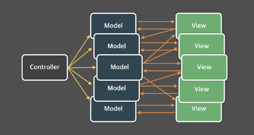

# 관심사의 분리

## 관심사의 분리 (SoC, Separation of Concerns)

어떤 것을 만들 때, 만드는 공정이 간단하다면 한 명의 생산자만 있어도 충분할 것이다. 하지만 공정이 복잡하다면 어떨까? 일상생활에서 볼 수 있는 전자제품이나 가구, 자동차 등이 공장에서 분업화되어 생산되고 있다. 각 공정을 나눠 분업함으로써 한 공정을 맡고 있는 기계 또는 사람은 다른 공정에 신경쓸 필요 없이 해당 공정에만 집중할 수 있고, 다른 공정에서 무언가 변경되거나 하더라도 신경쓸 필요가 없다.

이는 소프트웨어 개발에서도 적용된다. 어떤 복잡한 기능을 구현해야 할 때, 그 안에서 관심사에 따라 작게 기능을 나누고, 그 기능들을 독립적으로 개발하여 조립하는 형태로 복잡한 기능을 만들어 내는 것이다. 이러한 아이디어를 관심사의 분리라고 한다.

### 장점

- 코드의 가독성이 좋아진다.
- 유지보수성을 높여준다. 한 부분이 변경되더라도 다른 독립된 기능들에는 손을 댈 필요 없이 그 부분만 바꾸면 된다.
- 코드의 재사용이 쉽다.
- 코드를 재사용을 하면 중복 코드를 줄일 수 있어 소스 크기도 줄일 수 있다.

## Architecture Pattern

아키텍쳐 패턴이란, 웹 애플리케이션의 구조를 설계하고 구성하는 방법을 제공하는 패턴이다. 복잡한 프로젝트를 효과적으로 관리하기 위해 필요하다.

앞에서 얘기했던 관심사의 분리가 적용된 몇몇 패턴을 살펴보자.

### Layered Architecture

계층형 아키텍쳐는 관심사의 분리가 강하게 드러나는 아키텍쳐다. 관심사를 분리하면서 생기는 이점 또한 동일하게 가지고 있다.

#### 설계 관점에서 계층 분리하기

어플리케이션에서 사용자에게 가까운 지, 먼 지에 따라 계층을 구분할 수 있다.

- 사용자에게 가장 가까운 **화면(UI)**
- 가장 먼 **DB 작업**
- 그 사이를 연결하는 **비즈니스 로직**

이 3가지로 구분한다. 특정 계층의 구성요소는 해당 계층과 관련된 기능만 수행한다.

#### 프로세스 관점에서 계층 분리하기

프로세스 관점에서 계층을 나눠본다면 input, process, output으로 나눌 수 있다.

- Input : 사용자 또는 외부 시스템으로부터 입력 데이터를 받는다. HTTP 요청, DB 쿼리 등이 이에 속한다.
- Process : Input을 처리하는 비즈니스 로직이 담겨있다. 여러 개의 레이어로 구성될 수 있다.
- Output : 처리된 결과를 사용자에게 제공한다.

이러한 관점에서 봤을 때, MVC 아키텍쳐에 매핑해 볼 수 있다.

- Input - Controller
- Process - Model
- Output - View


MVC 아키텍처는 애플리케이션을 3가지 역할로 구분한 아키텍쳐다. 3가지 역할은 다음과 같다.

- Controller : 사용자의 입력을 받아 어떻게 처리할 지에 대해 Model과 View에게 전달하여 업데이트 요청을 한다.
- Model : 알고리즘이나 DB와의 상호작용 등 비즈니스 로직을 처리하기 위한 역할을 한다.
- View : 사용자에게 화면을 보여주기 위한 역할을 한다.



### Flux Architecture

#### 등장 배경

Flux는 기존의 MVC 아키텍처를 보완하기 위해 만들어졌다. Flux를 개발한 페이스북 팀에서 지적한 MVC 아키텍처의 문제점으로는, 거대한 애플리케이션에서 복잡성이 증대한다는 점이었다.

<figure><figcaption></figcaption></figure>

이미지에서 보이는 것처럼 하나의 View 당 하나의 Model만 매핑되는 것이 아닌 아니라 불규칙하게 여러 곳에 의존하고 있다. 서로 의존성이 크기 때문에 유지보수하기 굉장히 까다롭다. 또한 컨트롤 해야하는 Model, View가 늘어나면서 Controller의 역할이 커진다는 것도 단점이었다.

이러한 MVC 아키텍처의 단점을 보완하기 위해 Flux에서는 단방향 데이터 흐름을 채택했다.

#### 특징

<figure><figcaption></figcaption></figure>

가장 큰 특징은 단방향 데이터 흐름이다.

- Dispatcher : Action 객체를 받아 Store로 전달하는 역할을 한다. 데이터가 흐르는 일종의 허브라고 생각할 수 있다.

```js
dispatch(
    // Action
)
```

- Action : View에서의 사용자 상호작용에 의해 생성된다. 해당 상호작용에 따른 이벤트, 메세지 객체를 가지고있다.
- Store : 받은 Action에 따라 상태를 업데이트하고 저장하는 역할을 한다. 상태변경에 대한 이벤트를 발생시켜 View를 업데이트 한다.
- View : UI를 나타낸다. Action에 응답하여 데이터를 표시하거나 업데이트 한다.

Redux에서는 단일 Store만 사용하며, 단계가 좀 더 단순화 된다.

- Action
- Store : Dispatcher를 통해 Action을 받고, Reducer를 통해 State를 변경
- View : State 반영

이를 [3단계 프로세스](#프로세스-관점에서-계층-분리하기)에 매핑하면 다음과 같이 표현할 수 있다.

- Input - Dispatcher, Action
- Process - Reducer
- Output - View(React)

## 의존성 주입 (DI, Dependency Injection)

의존성 주입은 코드의 결합도를 낮추고 유지보수성을 향상시키는데 사용된다.

객체 지향 프로그래밍에서 많이 쓰이는 개념으로, 코드 간 결합도를 낮추기 위해 어떠한 요소를 직접 생성하지 않고 다른 곳에서 생성된 데이터를 주입하는 방식이다.

보통 흔히 사용하는 Redux 또한 스토어 객체를 외부에 생성한다. 컴포넌트는 자신만의 관심사에만 집중하며, 스토어에 있는 객체들을 여러 컴포넌트에서 주입받아 사용한다. 이 또한 의존성 주입이다.

의존성 주입을 통해 코드의 결합도를 낮추고, 관심사의 분리를 통해 코드의 재사용성과 유지보수성을 향상시킬 수 있다.

## External Store

단어 뜻 그대로 외부 저장소를 의미한다. 앞서 말했던 관심사의 분리를 위해 상태를 React의 컴포넌트 바깥에서 관리하는 의미에서 '외부' 저장소라 부른다.

지금까지 학습할 땐 상태를 useState를 통해 컴포넌트 내부에 만들고 props를 통해 전달해왔다. useState의 특성에 의해 state가 변경되면 자동으로 리렌더링 됐지만, 외부 저장소를 이용할 경우 수동으로 리렌더링 해줄 필요가 있다.

### 수동으로 리렌더링 하기

`forceUpdate`라는 함수가 있었다. 한창 클래스형 컴포넌트를 사용할 때 지원됐던 함수로, 강제로 렌더링 할 경우에 사용되는 함수였다. 하지만 이제는 지원하지 않아 다른 방법을 우회해야 한다. 간단히 우회할 수 있는 방안에는 두가지가 있다.

#### useReducer 사용하기

useReducer는 useState의 대체 함수로 사용된다. 다음 state가 이전 state에 의존적인 경우 보통 useState보다 useReducer를 더 선호한다.

```js
const [state, dispatch] = useReducer(reducer, init);
```

- reducer : `(state, action) => newState` 형태의 함수로, action에 담긴 프로퍼티 값에 맞게 state를 업데이트 한다.
- init : `state` 객체의 초기값
- dispatch : dispatch의 괄호 안 인자로 reducer 함수에 전달될 action 객체를 받는다. 객체 안 type 프로퍼티로 어떤 행위를 할 건지 나타낸다.

useReducer를 이용한 카운터 예시다.

```js
const initialState = {count: 0}; // init

function reducer(state, action) { // reducer
  switch (action.type) {
    case 'increment':
      return {count: state.count + 1};
    case 'decrement':
      return {count: state.count - 1};
    default:
      throw new Error();
  }
}

function Counter() {
  const [state, dispatch] = useReducer(reducer, initialState);
  return (
    <>
      Count: {state.count}
      <button onClick={() => dispatch({type: 'decrement'})}>-</button>
      <button onClick={() => dispatch({type: 'increment'})}>+</button>
    </>
  );
}
```

React 공식 문서에 [forceUpdate와 같은 것이 있습니까?](https://ko.reactjs.org/docs/hooks-faq.html#is-there-something-like-forceupdate) 를 확인하면 이 useReducer를 이용한 `forceUpdate` 생성 방법이 나와있다.

```js
const [, forceUpdate] = useReducer(x => x + 1, 0);
forceUpdate();
```

dispatch 함수(`forceUpdate`)가 실행되면 reducer 함수에 아무것도 전달하지 않아도 자체적으로 새로운 state를 생성하여 자동으로 리렌더링 되도록 만들어져 있다.

#### useState 사용하기

같은 맥락으로 useState를 사용할 수도 있다.

```js
const [, setState] = useState({});
const forceUpdate = () => setState({});
forceUpdate();
```

#### 커스텀 훅 만들기

앞에서 언급한 방법을 통해 forceUpdate 커스텀 훅을 만들어 사용할 수 있다.

```js
function useForceUpdate() {
    const [, setState] = useState({});
    return useCallback(() => setState({}), []);
}
```

useCallback은 메모이제이션 된 함수를 반환한다. 의존성 배열에 있는 요소가 바뀌었을 때만 새로운 함수를 반환하고, 그 외에는 동일한 함수만 반환하게 된다. 이를 이용하면 다른 곳에서 `forceUpdate` 자체를 의존성 요소로 사용할 수 있다.
