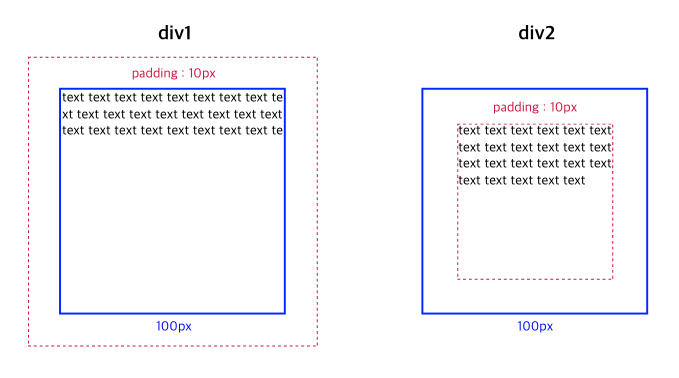
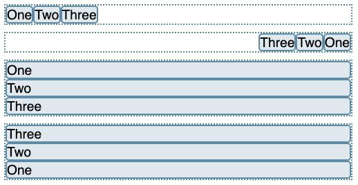
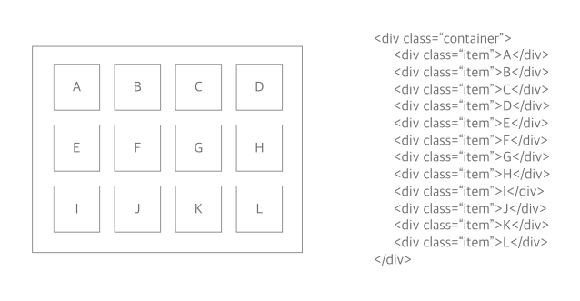
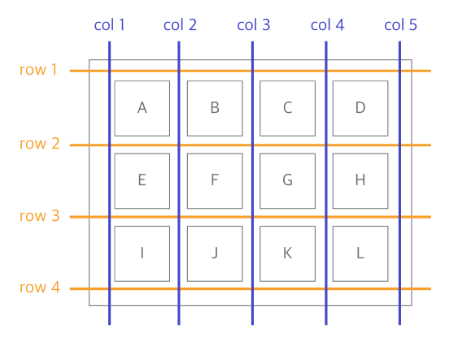

# CSS

CSS는 Cascading Style Sheets의 약자로, 웹사이트의 디자인과 레이아웃을 담당하는 스타일 시트 언어다.

Cascading는 '위에서 아래로 흐르는', '종속하는' 이런 의미를 가지고 있는데, CSS의 스타일 우선순위와 스타일 상속에 대한 원칙이라 할 수 있다.

## CSS 규칙

- 부모 요소에 지정된 스타일은 자식 요소에 상속된다. (상속되지 않는 속성도 있으므로 주의)
- 나중에 작성된 CSS 규칙이 우선 적용된다.
- 명시도 : 선택자의 명시도에 따라 CSS 규칙 우선순위가 달라진다.
  - id명 100점 > class명 10점 > 태그명, * 등 1점
- 중요도 : `!important` 키워드 사용 시, 최우선순위로 등록된다.

스타일 조건 적용 우선순위는 `중요도(importante) > 명시도 > 시트 내 순서(나중에 작성된 스타일 우선) > 브라우저 기본 스타일` 이다.

```css
main h1.title{
    color: green;
}
h1.title {
    color: blue;
}
h1 {
    color : red;
}
```

예제에서 스타일을 적용시킨 선택자는 모두 동일하지만, 시트 내 순서보다 명시도의 우선순위가 더 높아 color 속성이 green으로 적용된다.

## 알아두면 좋은 CSS

### 선택자

- 전체 선택자 : *
- 태그 선택자 : 태그 이름 명시 (div, p, input...)
- 클래스 선택자 : .class
- ID 선택자 : #id
- 속성 선택자 : [attr=value]
- 그룹 선택자 : A, B

```css
/* 전체 선택자에 대해 스타일 적용 */
* {
    box-sizing: border-box;
}

/* 태그명 선택자 */
h1 {
    background-color: yellow;
}

/* 클래스 선택자 */
.title {
    background-color: yellow;
}

/* 아이디 선택자 */
#title{
    background-color: yellow;
}

/* 'href' 이라는 속성을 사용한 input */
input[href] {
  background-color: yellow;
}

/* 'href' 속성에 'https://example.com'라는 값이 적용된 input */
input[href="https://example.com"] {
  background-color: yellow;
}

/* 그룹 선택자 - 쉼표로 구분된 모든 선택자에 스타일 적용 */
h1, h2, h3{
    background-color: yellow;
}
```

- 가상 클래스 : `:` 기호 뒤에 요소의 특정 상태를 선택할 수 있다.
- 가상 요소 : `::` 기호 뒤에 선택자와 관련된 특정 요소를 선택할 수 있다.

```css
button:hover {
  color: blue;
}
input:focus {
  background-color: yellow;
}

li::after{
    display: block;
    width : 2px;
    height: 2px;
    background-color: black;
}
input::placeholder{
    color: lightgrey;
}
```

### 박스 모델

어떤 div 요소가 있다고 가정해보자. 너비와 높이를 100px로 정하고, div의 외곽선으로부터 10px 쯤 띄우고 텍스트를 넣고싶은데, 생각대로 잘 되지 않을수도 있다.

그 이유는 스타일 속성 중 `box-sizing` 때문이다. 이 속성이 의미하는 바는 '박스의 사이즈를 어디를 기준으로 너비와 높이를 정할건지' 이다. 브라우저 기본 스타일은 이 속성이 `content-box`로 되어있어서 너비와 높이를 100px로 정한 순간 텍스트가 들어가는 영역이 100px이 되고, 패딩이나 마진은 그 밖에서 영역이 잡힌다.

말그대로 `box-sizing`은 어떤 것을 기준으로 box의 사이즈를 정할거냐고 묻는거기 때문에, 내가 원하는 모양대로 총 박스의 크기를 여백 포함 100px로 정하고 싶다면 `box-sizing: border-box` 로 설정해야 한다.

아래는 쉽게 이해할 수 있도록 만든 자료다.

```css
div {
    width: 100px;
    height: 100px;
    padding: 10px;
}
div.div1{
    box-sizing: content-box;
}

div.div2{
    box-sizing: border-box;
}
```

<figure><figcaption></figcaption></figure>

### Media Query

브라우저 및 디바이스의 환경에 따라 다른 CSS 규칙을 설정할 수 있는 옵션이다. 반응형 웹 디자인의 핵심 부분이라 할 수 있다.

```css
@media media-type and (media-feature-rule) {
  /* CSS rules go here */
}
```

media-type 목록은 다음과 같다.

- all
- print : 페이지가 인쇄된 경우에 스타일 적용
- screen : 화면과 관련하여 특정 규칙을 가졌을 경우 스타일 적용
- speech : 스크린 리더에서 스타일 적용

반응형 웹에서 보통 screen 타입으로 디바이스의 너비에 따라 특정 스타일을 적용시킨다. 너비에 대한 규칙은 최소 너비, 최대 너비로 규칙을 정할 수 있으며 두가지를 동시에 적용할 수도 있다.

```css
@media screen and (min-width: 480px) {
    body {
        color: red;
    }
}

@media screen and (min-width: 800px) and (max-width: 1200px) {
    body {
        color: blue;
    }
}
```

`min-width`는 최소 너비를 의미하며, 해당 너비 이상의 화면에서 특정 스타일이 적용되고 `max-width`는 최대 너비를 의미하여 해당 너비 이하의 화면에서 특정 스타일이 적용된다.

### Flexbox

Flexbox는 하위 요소의 레이아웃 구조를 다룰 때 사용하는 방법이다. 하위 요소를 가로 또는 세로로 나열할 수 있고, 여러 속성을 사용하여 하위 요소들의 위치를 지정할 수 있다.

나열할 하위 요소를 감싸고 있는 부모 요소를 Flex Container 요소라고 하며, `display: flex`로 지정할 수 있다. Flexbox와 관련된 다른 속성을 사용하고 싶다면 컨테이너 요소에서 사용하면 된다. Flex Container의 바로 아래에 있는 하위 요소만 나열되는 점에 주의하자.

`flex-direction`은 **하위 요소를 나열할 방향**을 의미하며, 속성 값은 다음과 같다.

<figure><figcaption></figcaption></figure>

- row : 주축이 가로선이 되며 하위 요소를 차례대로 주축 방향으로 나열, 시작점이 왼쪽
- row-reverse :  주축이 가로선이 되며 하위 요소들의 순서를 뒤집어 주축 방향으로 나열, 시작점이 오른쪽
- column : 주축이 세로선이 되며 하위 요소를 차례대로 주축 방향으로 나열, 시작점이 윗쪽
- column-reverse : 주축이 세로선이 되며 하위 요소들의 순서를 뒤집어 주축 방향으로 나열, 시작점이 아래쪽


주축 : Flex 컨테이너 안에서 하위 요소들이 나열되는 방향을 의미한다.
교차축 : 주축의 수직 방향을 의미한다.
시작점(start) : 주축이 가로 방향이면 왼쪽, 세로 방향이면 윗쪽을 의미하며 reverse 옵션이 붙으면 반대 방향이 된다.
끝점(end) : 시작점의 반대쪽을 의미한다.


`flex-wrap`은 **하위 요소가 나열됐을 때 Flex 컨테이너 공간이 부족하면 자동으로 줄띄움 할지**에 대한 여부를 의미한다.

- wrap : 공간이 부족할 때 자동 줄띄워서 여러 행으로 만듬
- nowrap : 줄띄움 하지 않음. 하위 요소의 사이즈가 줄어들거나 Flex 컨테이너를 벗어날 수 있다.

**하위 요소의 크기**를 결정하는 속성도 있다. 이 속성들은 Flex 컨테이너가 아닌 각 하위 요소에서 값을 부여한다.

- flex-basis : 하위 요소의 크기를 설정할 수 있다. 기본값은 auto다.
- flex-grow : Flex 컨테이너에서 하위 요소가 차지하는 범위 외에 공간이 남아있다면, 하위 요소들이 나눠가질 남은 공간의 비율을 지정하는 속성이다.
- flex-shrink : 하위 요소들이 차지하는 공간이 Flex 컨테이너를 벗어나 넘쳤을 때, Flex 컨테이너에서 넘치지 않고 딱 맞도록 하위 요소들을 줄이는 비율을 지정하는 속성이다. 따라서 `flex-wrap: wrap`으로 설정하면 해당 속성은 적용되지 않는다.

**하위 요소를 정렬**하는 속성은 다음과 같다.

- align-items : Flex 컨테이너에서 값을 부여하며, **교차축을 기준**으로 하위 요소를 어떻게 정렬할건지를 지정한다. 하위 요소의 높이 또는 너비(둘 중 교차축 방향에 놓인 것)가 달라질 수 있다.
  - stretch : 기본값으로, 교차축의 시작점에 정렬되어 있다. 하위 요소들의 높이 또는 너비가 교차축 방향으로 컨테이너 내 최대치가 된다.
  - flex-start : 교차축의 시작점에 정렬되어 있다. 하위 요소들의 높이 또는 너비가 자기 자신의 높이 또는 너비를 갖는다.
  - flex-end : 교차축의 끝점에 정렬되어 있다. 하위 요소들의 높이 또는 너비가 자기 자신의 높이 또는 너비를 갖는다.
  - center : 교차축의 중앙에 정렬되어 있다. 하위 요소들의 높이 또는 너비가 자기 자신의 높이 또는 너비를 갖는다.
- justify-content : Flex 컨테이너에서 값을 부여하며, **주축을 기준**으로 하위 요소를 어떻게 정렬할건지를 지정한다.
  - flex-start : 기본값으로, 주축의 시작점에 정렬되어 있다.
  - flex-end : 주축의 끝점에 정렬되어 있다.
  - center : 주축의 중앙에 정렬되어 있다.
  - space-around : 하위 요소들의 주축 양방향에 모두 동일한 마진을 넣은 것처럼 간격을 맞춘다.(하위 요소들 간 간격 = 주축 끝 쪽 여백 * 2)
  - space-between : 주축의 양 끝의 여백은 없애고, 하위 요소들의 간격을 모두 동일하게 맞춘다.
  - space-evenly : 주축의 양 끝 여백을 포함하여 하위 요소들의 간격을 모두 동일하게 맞춘다.

### Grid

Grid도 하위 요소의 레이아웃 구조를 다룰 때 사용하는 방법이다. Flex와는 다르게 **2차원 구조(바둑판식)로 하위 요소를 배열**한다. Flex 처럼 하위 요소를 감싸고있는 Grid 컨테이너에 `display: grid`를 추가하면 Grid 레이아웃을 사용할 수 있다.

<figure><figcaption></figcaption></figure>

**Grid의 형태를 정의**할 때 사용하는 기본 속성은 다음과 같다.

- grid-template-columns : 하위 요소를 열 방향으로 몇 개의 열을 가질지, 어떤 크기의 열을 가질지 적용할 수 있다.
- grid-template-rows : 하위 요소를 행 방향으로 몇 개의 행을 가질지, 어떤 크기의 행을 가질지 적용할 수 있다.

```css
.container {
    grid-template-columns: 200px 200px 500px;
    grid-template-rows: 1fr 1fr 1fr;
    grid-template-columns: repeat(3, 1fr);
    grid-template-rows: 200px 1fr;
    grid-template-columns: 100px 200px auto;
    grid-template-rows: repeat(3, minmax(20%, auto));
    grid-template-columns: repeat(auto-fill, minmax(25%, auto)); 
    grid-template-rows: repeat(auto-fit, minmax(25%, auto)); 
}
```

`grid-template-columns`와 `grid-template-rows`는 같은 형태로 값을 부여한다. 여기서 사용된 단위에 대해 설명해보자면,

- `200px 200px 500px` : 하위 요소에 순서대로 px 단위의 사이즈를 부여한다.
- `1fr 1fr 1fr` : Grid 컨테이너를 100%로 보고 하위 요소를 1:1:1 비율로 사이즈를 부여한다.
- `repeat(3, 1fr)` : 3개의 하위 요소에 1fr을 부여한다는 의미로, `1fr 1fr 1fr`와 동일하다.
- `200px 1fr 2fr` : 첫번째 하위 요소에 200px를 부여하고, 남은 하위 요소에게 남은 컨테이너 공간의 1:2 비율로 사이즈를 부여한다.
- `100px 200px auto` : 첫번째 하위 요소에 100px, 두번째 하위 요소에 200px을 부여하고, 세번째 하위 요소는 남은 컨테이너 공간에 맞춘다.
- `repeat(3, minmax(20%, auto))` : 3개의 하위 요소 사이즈의 최솟값과 최댓값을 제한한다. 여기서 사용된 코드는 최소 20%(컨테이너 기준 20%) 이상을 유지하라는 의미다.
- `repeat(auto-fill, minmax(25%, auto))` : `auto-fill`은 열 또는 행에 몇 개의 하위 요소를 채울건지 제한하지 않고, 하위 요소의 사이즈에 따라 알아서 맞추라는 의미다. 여기서는 최소 25%의 사이즈를 갖게 했으므로, 한 행에 최대 4개의 하위 요소가 배치될 수 있다.
- `repeat(auto-fit, minmax(25%, auto))` : `auto-fit`은 `auto-fill`처럼 자동으로 하위 요소를 배치하다가 하위 요소 개수가 모자라거나 하위 요소의 너비가 25%보다 넘쳤을 경우 컨테이너에 여백이 생기게되면 자동으로 하위 요소의 크기를 키워 딱 맞게 배치하라는 의미다.

만약 요소의 개수를 미리 알 수 없다면 다음 속성을 쓸 수 있다. 이 속성에 요소의 개수와 관련없이 제한할 사이즈만 적어두면, **그리드 형태를 자동으로 정의**한다.

2개 이상의 사이즈 제한(차례대로 반복하여 적용됨)도 가능하며, 여백으로 구분한다. 단, 따로 속성을 부여하지 않은 하위 요소에만 규칙이 적용된다.

- grid-auto-columns
- grid-auto-rows

```css
.container1 {
    grid-template-columns: 50px;
    grid-auto-columns: 1fr 2fr; /* 첫 열을 제외한 모든 열을 1:2 비율을 반복하여 적용 */
}
```

**하위 요소들의 간격**을 정하는 속성은 다음과 같다.

- row-gap : 행 간 간격
- column-gap : 열 간 간격
- gap : 행과 열의 간격을 한번에 설정

**각 하위 요소들의 영역을 지정**할 수 있는 속성도 있다. 이 속성은 컨테이너가 아닌 각 하위 요소에서 사용한다.

<figure><figcaption></figcaption></figure>

- grid-column : 열 시작선 번호 / 열 끝선 번호
- grid-row : 행 시작선 번호 / 행 끝선 번호

```css
/* 위 이미지에서 A 요소가 A + B 요소의 자리를 차지하게 된다. */
.item:nth-child(1) {
    grid-column: 1 / 3;
    grid-row: 1 / 2;
}
```

```css
/* 위 이미지에서 A 요소가 B 요소에 있게 되며, 기존의 A 자리는 비게 된다. 나머지 요소들은 한 칸씩 밀리게 된다. */
.item:nth-child(1) {
    grid-column: 2 / 3;
}
```

```css
/* span 은 칸 수를 의미한다. 위 이미지에서 A 요소가 A, B, E, F, I, J 요소의 자리를 차지하고, 나머지 요소들은 다른 공간에서 재배치된다. */
.item:nth-child(1) {
    grid-column: 1 / span 2;
    grid-row: 1 / span 3;
}
```

참고로, 끝 번호는 적어주지 않아도 된다.

### word-break

컨텐츠 내 텍스트가 길어져 컨텐츠 밖으로 오버플로우 됐을 때 텍스트를 어떻게 처리할지에 대한 속성이다.

- break-all : 여백이 없어도 단어를 끊어서 오버플로우 되지 않게 한다.
- keep-all : 여백이 없다면 단어를 끊지 않아 오버플로우 될 수 있다.
- normal : CJK 문자는 break-all, CJK 이외의 문자는 keep-all이 적용된다. (기본값)
